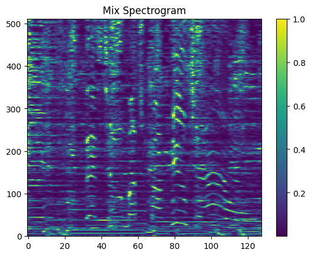
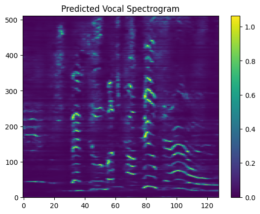

# SoundSeg

## Introduction
SoundSeg is an advanced audio processing project, focused on segmenting and analyzing sound data. The core of the project revolves around machine learning models, specifically designed for audio source seperation of songs into the vocal component.

Please see the projects preprint for more details: [Spectral Mapping of Singing Voices: U-Net-Assisted Vocal Segmentation](paper.pdf)

## Example Audio and Spectrograms

### Original Audio
- Mixture: 
  <audio controls>
    <source src="assets/jimi_mix.wav" type="audio/wav">
    Your browser does not support the audio element.
  </audio>
### Predicted Output
- Vocal (Predicted): 
  <audio controls>
    <source src="assets/jimi_pred_vocal.wav" type="audio/wav">
    Your browser does not support the audio element.
  </audio>

### Spectrograms
- Mixture: 

- Vocal (Predicted): 

## Contents
- **MUSDB_README.md**: Provides details on the MUSDB 2018 Dataset, crucial for training and testing the models.
- **demo.ipynb**: A Jupyter notebook demonstrating the capabilities of SoundSeg.
- **src**: Contains the source code of the project.
- **Scripts**: Shell scripts for preprocessing (`0_preprocess.sh`), training (`1_train.sh`), and evaluation (`2_eval.sh`).
- **Python Modules**: Core modules like `model.py`, `preprocessing.py`, `train.py`, `evaluate.py`, etc., for model development and data handling.
- **requirements.txt**: Lists all the necessary dependencies.
- **analysis.ipynb**: Additional Jupyter notebook for deeper analysis.

## Usage

1. **Preprocessing**: Run the `0_preprocess.sh` script to prepare your data.
2. **Training**: Execute the `1_train.sh` script to train the models.
3. **Evaluation**: Use the `2_eval.sh` script for model evaluation.
4. **Demo**: Explore `demo.ipynb` for hands-on examples and usage demonstrations.

5. **Analysis**: Delve into `analysis.ipynb` for in-depth analytical insights.

## Model Weights

Download the pre-trained model weights from the following links:
- Google Drive Link [https://drive.google.com/file/d/1_myj2HVAg-g6SR44jSRB9tIkv7BhF1gU/view?usp=sharing]

## Results

| **SDR** | **SIR** | **SAR** | **Normalization** | **Scaler** | **Loss** |
|---------|---------|---------|-------------------|------------|----------|
| 7.1     | 25.2    | 7.2     | frequency         | Min/Max    | MAE      |
| 7.1     | 25.1    | 7.2     | time              | Min/Max    | MAE      |
| 6.7     | 24.8    | 6.8     | frequency         | Min/Max    | MSE      |
| 5.7     | 23.9    | 5.8     | time              | Quantile   | MAE      |
| 5.6     | 23.3    | 5.7     | time              | Min/Max    | MSE      |
| 4.8     | 22.6    | 4.9     | time              | Quantile   | MSE      |
| -0.9    | 16.6    | -0.6    | frequency         | Quantile   | MSE      |
| -2.1    | 15.8    | -1.8    | frequency         | Quantile   | MAE      |

## Acknowledgments

Special thanks to the creators of the MUSDB 2018 Dataset and all contributors to this project.
